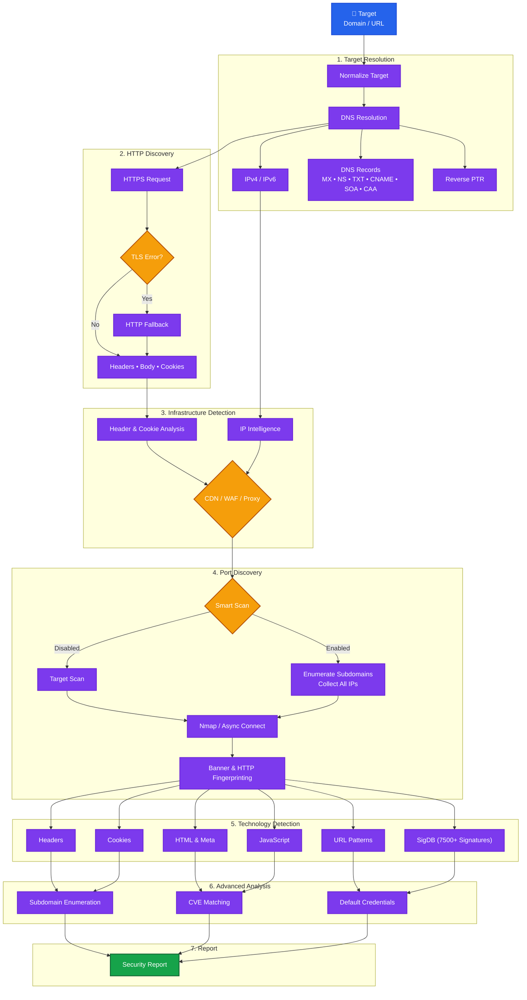

<h1 align="center">stackscan</h1>

<h4 align="center">Full web stack, infrastructure, DNS, port, subdomain and CVE analyzer — one command, one colorized report.</h4>

<p align="center">
  <a href="LICENSE"></a>
  
  
  
  
  
  
  
</p>

---

**stackscan** takes one or more targets, fetches them over HTTP(S), and prints a
single colorized panel report covering the technology stack, the edge and
network infrastructure, full DNS, IP ownership, open ports, subdomains, and
known CVEs. A signature database and a compressed CVE database ship inside the
package, so it works out of the box.

Every default pass only reads what a server voluntarily returns. The **active**
passes — `--ports` and `--default-creds` — open connections the target did not
solicit and are opt-in. **Only scan systems you are authorized to test.**

---

## 📦 Installation

```bash
pip install "stackscan"

# optional extra
pip install "stackscan[geo]"   # offline IP geolocation via geoip2 + a MaxMind .mmdb
```

`nmap` is used for port scans when present; without it a pure-Python scanner is
used automatically.

---

## ✨ Features

### 🧩 Stack & infrastructure
- **Technologies** — 7.5k-technology bundled [sigdb](https://github.com/reekeer/sigdb), classified by category.
- **Edge** — CDN, WAF, reverse proxy and server software from response metadata.
- **TLS** — certificate issuer, SANs, validity window, protocol and cipher.

### 🌐 Network & DNS
- **Full DNS** — `A`/`AAAA`, reverse DNS, `CNAME`, `MX`, `NS`, `TXT`, `SOA`, `CAA`.
- **IP intelligence** — hosting org / ISP / ASN / location for non-CDN origins via [ipwho.is](https://ipwho.is).
- **Subdomains** — AXFR + the popularity-ranked [SecLists](https://github.com/danielmiessler/SecLists) DNS list over a fast async resolver pool, with wildcard filtering + TLS SANs.

### 🔎 Ports & vulnerabilities
- **Ports** — `nmap -sV` via `python-nmap`, or a built-in async connect scan with banner/HTTP/RTSP fingerprinting.
- **CVEs** — offline NVD-sourced database with per-match **confidence %** and CVSS **severity**; `--cve-online` adds a live lookup.
- **Default creds / open devices** — a bounded, authorized-only check for cameras / routers / panels reachable without a password or with factory-default logins (SecLists default-credentials).

### 🎛 Output
- Colorized per-target panels, a `--compact` table, or `--json`.
- Every run prints the banner and the total scan time.

---

## 🚀 Usage

```bash
# Scan one or more targets
stackscan example.com https://another.example

# Everything at once: ports, subdomains, online CVEs, IP info, default-cred check
stackscan --full example.com

# Individual deep passes
stackscan --ports --subdomains example.com
stackscan --cve-online example.com

# Speed / coverage knobs
stackscan --full --workers 500 --subdomain-limit 10000 example.com
stackscan --full --site-limit 10 --workers 200 example.com

# JSON (full detail, includes timing) or a compact table
stackscan --json example.com
stackscan --compact a.example b.example
```

Bare hostnames are normalized to `https://`.

## ⚡ Benchmark

Below are performance benchmarks conducted on two production targets using different scanning options (tested on Python 3.12 / macOS).

### 1. `github.com` Scan Performance

| Scan Mode | Command / Arguments | Execution Time (s) | Execution Time (ms) | Speed vs. Default (Baseline) |
| :--- | :--- | :---: | :---: | :---: |
| **Minimal Scan** | `--no-dns --no-tls --no-geo --no-ip-info --no-cve --no-probe` | **0.69s** | `690 ms` | **+86.09% faster** (7.2x) |
| **Default Scan** | *None (baseline)* | **4.96s** | `4960 ms` | *Baseline* |
| **Port Scan** | `--ports` | **6.10s** | `6100 ms` | **-22.98% slower** |
| **Full Active Scan** | `--full` | **64.99s** | `64990 ms` | **-1210.28% slower** |

### 2. `kmtn.ru` Deep Scan Performance

| Scan Mode | Command / Arguments | Execution Time | Findings |
| :--- | :--- | :---: | :--- |
| **Full Active Scan** | `--full --subdomain-limit 50 --site-limit 20` | **1m 8.4s (68s)** | 269 CVE(s), 64 critical, 29 port(s), 41 subdomain(s), 11 site(s) |
| **Fast Full Scan** | `--full --subdomain-limit 50 --workers 400 --site-limit 20` | **~32s** | 247 CVE(s), 63 critical, 15 port(s), 41 subdomain(s), 9 site(s) |

### 3. `microsoft.com` Scan Performance

| Scan Mode | Command / Arguments | Execution Time (s) | Execution Time (ms) | Speed vs. Default (Baseline) |
| :--- | :--- | :---: | :---: | :---: |
| **Minimal Scan** | `--no-dns --no-tls --no-geo --no-ip-info --no-cve --no-probe` | **0.98s** | `980 ms` | **+83.39% faster** (6.0x) |
| **Default Scan** | *None (baseline)* | **5.90s** | `5900 ms` | *Baseline* |
| **Port Scan** | `--ports` | **6.95s** | `6950 ms` | **-17.80% slower** |

> [!NOTE]
> * **Minimal Scan** only fetches the HTTP response and runs the offline technology matcher.
> * **Default Scan** resolves DNS (including CNAME/MX/NS/SOA), performs TLS handshake analysis, resolves GeoIP info, and queries IPWHOIS.
> * **Full Scan** triggers active subdomain enumeration (AXFR + wordlist), parallel smart port scanning of all resolved endpoints, vulnerability matching, and default credential brute-forcing.

---

## 🧭 Options

| Option | Default | Description |
| :--- | :---: | :--- |
| `--full` | off | Enable ports, subdomains, online CVEs, IP info, default-cred check. |
| `--ports` / `--no-nmap` | off | Active port scan (nmap, else Python) / force the Python scanner. |
| `--subdomains` | off | Enumerate subdomains (AXFR + wordlist + TLS SANs). |
| `--subdomain-limit` | `5000` | Max ranked labels to resolve (`0` = full list). |
| `--site-limit` | `20` | Max derived sites to analyze from discovered open ports (`0` = unlimited). |
| `--default-creds` | off | Bounded default-credential / open-device check. |
| `--cred-limit` | `50` | Max default-credential pairs per device (`0` = full SecLists list). |
| `--cve-online` | off | Also query NVD live for detected products. |
| `--parse-social` | off | Extract social media and contact links from the page. |
| `--workers` | `350` | Parallel workers for ports/subdomains/creds. |
| `--concurrency` | `10` | Concurrent targets. |
| `--sigdb` / `--no-builtin` / `--no-sources` | – | Signature database selection. |
| `--geoip-db` | – | MaxMind `.mmdb` for offline IP geolocation. |
| `--no-dns` / `--no-tls` / `--no-geo` / `--no-probe` / `--no-cve` / `--no-ip-info` | off | Skip a pass. |
| `--json` / `--compact` / `--no-banner` / `--show-empty` | off | Output control. |
| `-f`, `--file` / `--timeout` / `--port-timeout` / `--version` | – | Misc. |

---

## ⚙️ Configuration

- **Signature sources**: `stackscan sigdb add|list|update|remove …` (recorded under `$XDG_CONFIG_HOME/stackscan/`).
- **Downloaded wordlists** (SecLists DNS list, default-credential list): cached under `~/.local/stackscan/db/`.
- **Refresh the CVE database**: `python scripts/build_cve_db.py`.

---

## 🚀 Smart Scan Pipeline

The Smart Scan engine performs multiple analysis stages to collect infrastructure, technology, and security information about the target before generating the final report.



### Pipeline Stages

| Stage | Description |
| :--- | :--- |
| **1. Target Resolution** | Normalize the input target, resolve IPv4/IPv6 addresses, collect DNS records, and perform reverse PTR lookups. |
| **2. HTTP Discovery** | Send an initial HTTPS request with automatic HTTP fallback and collect response headers, cookies, redirects, and HTML. |
| **3. Infrastructure Detection** | Detect CDN, WAF, reverse proxies, and hosting providers using HTTP fingerprints and IP intelligence. |
| **4. Port Discovery** | Scan services using **Nmap** or the built-in asynchronous scanner. Smart Scan expands the scan across all discovered IP addresses. |
| **5. Technology Detection** | Fingerprint web technologies using headers, cookies, HTML, JavaScript, URL patterns, and the **7500+ signature** database. |
| **6. Advanced Analysis** | Enumerate subdomains, correlate detected software with CVEs, and test common default credentials. |
| **7. Report Generation** | Merge all collected information into a comprehensive security report. |

---

## 🗂 Structure

```
stackscan/
├── src/stackscan/
│   ├── analyzers/     ← tech, infra, security, exposure, cve, creds
│   ├── net/           ← dns, tls, geo, ipinfo, ports, fingerprint, subdomains
│   ├── config/        ← bundled + sourced sigdb loading
│   ├── data/          ← builtin.sigdb, cve.json.gz, subdomains.txt
│   ├── render.py      ← the colorized panel report
│   ├── scan.py        ← per-target orchestration
│   └── cli.py         ← argument parsing and entry point
├── scripts/           ← build_cve_db.py (NVD → offline dataset)
└── tests/
```

---

## 🛠 Development

```bash
ruff check . && black --check . && pyright && pytest
```

---

<p align="center"><sub><a href="LICENSE">MIT</a> © reekeer</sub></p>
