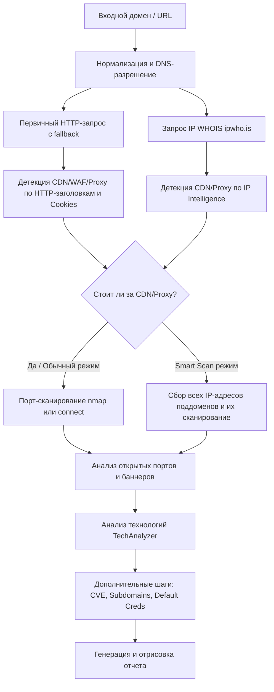

# Архитектура и пайплайн работы `stackscan`

В этом документе подробно описан жизненный цикл сканирования цели в проекте `stackscan` с отсылками к конкретным файлам исходного кода.

---

## Общая схема пайплайна

Когда утилита получает цель (домен или URL), выполнение проходит через следующие ключевые этапы:

---

## Подробный разбор каждого этапа

### 1. Нормализация ввода и DNS-разрешение
Входной URL-адрес передается в функцию [scan_target](file:///Users/del/projects/reekeer/stackscan/src/stackscan/scan.py#L376-L459). 
* Из URL с помощью `host_of` извлекается хост.
* Функция `_resolve_network` вызывает [resolve_host](file:///Users/del/projects/reekeer/stackscan/src/stackscan/net/dns.py#L128-L150) для получения:
  * IP-адресов (`IPv4` / `IPv6`) через стандартный `socket.getaddrinfo`.
  * Дополнительных DNS-записей (`CNAME`, `MX`, `NS`, `TXT`, `SOA`, `CAA`) с помощью библиотеки `dnspython` (если она установлена).
  * Обратных DNS-имен (`PTR` записи) для каждого IP с помощью `socket.gethostbyaddr`.

### 2. Первичный HTTP-запрос и Fallback (`_fetch_with_fallback`)
Для извлечения базовой информации о сайте выполняется асинхронный HTTP-запрос:
* Запрос отправляется методом `GET` через `StackscanSession.fetch` (внутри используется `aiohttp.ClientSession`).
* В случае ошибки подключения по `https://` срабатывает fallback-логика на `http://` (см. [_fetch_with_fallback](file:///Users/del/projects/reekeer/stackscan/src/stackscan/scan.py#L60-L83)).
* Возвращается структура `FetchResult`, содержащая финальный URL (с учетом редиректов), HTTP-статус, заголовки, тело ответа и Cookies.

### 3. Детекция CDN / Proxy / WAF
В `stackscan` проверка на наличие проксирования и использование защитных экранов (WAF) / CDN идет по двум направлениям:

#### А. Анализ HTTP-заголовков и Cookies (Infra)
В файле [infra.py](file:///Users/del/projects/reekeer/stackscan/src/stackscan/analyzers/infra.py) объявлены сигнатуры известных провайдеров. Функция [analyze_infra](file:///Users/del/projects/reekeer/stackscan/src/stackscan/analyzers/infra.py#L95-L114) проверяет:
* **CDN-сигнатуры:** заголовки `Server: cloudflare`, `cf-ray`, `x-served-by` (Fastly), `x-amz-cf-id` (CloudFront), `via: 1.1 google` и т.до.
* **WAF-сигнатуры:** `cf-ray` (Cloudflare), `x-sucuri-id`, `x-iinfo` (Imperva), `x-amzn-waf-action` (AWS WAF) и др.
* **Cookies:** Присутствие кук вроде `__cf_bm`, `__cfduid` (Cloudflare), либо `bigipserver...` (F5 BIG-IP).
* **Прокси:** Заголовок `Via`, а также использование балансировщиков и прокси-серверов (`OpenResty`, `Envoy`, `HAProxy`, `Traefik`).

#### Б. Интеллектуальный анализ IP-адресов (IP Intelligence)
Если включена опция `ip_info` (по умолчанию включена), функция [enrich_ips](file:///Users/del/projects/reekeer/stackscan/src/stackscan/net/ipinfo.py#L48-L88) асинхронно отправляет запросы к API `https://ipwho.is/<IP>` для каждого найденного IP-адреса:
* API возвращает страну, город, ASN, ISP (провайдера) и Organization (владельца подсети).
* Внутренний метод `_looks_like_cdn` проверяет имя провайдера/организации на наличие ключевых слов: `cloudflare`, `fastly`, `akamai`, `google`, `aws`, `azure`, `incapsula`, `imperva` и т.д.
* Если совпадение найдено, проставляется флаг `is_cdn = True`.

---

### 4. Сканирование портов (`scan_ports`)
Порт-сканер запускается, если передан флаг `--ports` или включен `--full` (активирующий `smart_scan`).

* **Обычный режим (`--ports`):** Сканирует сам домен.
* **Smart Scan режим (`--smart-scan`):** Сначала собирает все уникальные IP-адреса из DNS-записей и обнаруженных поддоменов, а затем запускает сканирование портов параллельно для каждого IP-адреса.
* **Способ сканирования:**
  * **Nmap (Рекомендуемый):** Если в системе установлен бинарный файл `nmap` и библиотека `python-nmap`, запускается сканирование командой `nmap -Pn -sV --version-light -T4`. Это позволяет максимально точно определить версии сервисов за счет встроенных сигнатур nmap.
  * **Python Connect Scan:** Если `nmap` недоступен, используется встроенный асинхронный сканер на `asyncio.open_connection`, проверяющий порты из предопределенного списка `COMMON_PORTS`.

#### Опрос открытых портов (Banner / HTTP-fingerprinting):
Если порт открыт при Python-сканировании:
* Для портов с текстовыми протоколами (SSH, FTP, SMTP) считывается приветственный баннер и парсится регулярными выражениями (`fingerprint_banner`).
* Для HTTP-портов (80, 443, 8080, 3000 и др.) отправляется сырой HTTP-запрос `GET /` для получения заголовка `Server` (`fingerprint_http`).

---

### 5. Анализ веб-технологий (Tech Detection)
Главный инструмент разбора технологий на сайте — класс [TechAnalyzer](file:///Users/del/projects/reekeer/stackscan/src/stackscan/analyzers/tech.py#L90-L151). Он принимает на вход результаты основного HTTP-запроса, а также данные с обнаруженных HTTP-портов.

Внутри метода `detect` происходит парсинг ответов по нескольким направлениям:
1. **Заголовки (Headers):** Поиск признаков серверных технологий, таких как `x-powered-by`, `x-generator`, `x-vercel-id`.
2. **Cookies:** Поиск кук сессий популярных CMS и фреймворков (например, `phpsessid`, `laravel_session`, `wordpress_`, `jsessionid`, `connect.sid`).
3. **Мета-теги страницы:** Вытаскиваются все теги `<meta>` с помощью регулярных выражений. Ищутся признаки CMS в атрибутах `generator` и других.
4. **Скрипты (`<script src="...">`):** Парсятся пути к подключаемым JS-скриптам для выявления фронтенд-библиотек (React, Angular, Vue, jQuery) и метрик (Google Analytics, Yandex Metrika).
5. **Тело HTML-страницы:** Проверка содержимого страницы по регулярным выражениям из базы сигнатур.
6. **URL-адрес:** Поиск характерных паттернов в URL (например, `/wp-content/`).

Все проверки сопоставляются со встроенной базой `SigDBMatcher`, которая содержит около **7500 сигнатур** веб-технологий.

---

### 6. Дополнительные проверки (CVE, Поддомены, Default Credentials)
Если включены соответствующие опции:
* **Поиск поддоменов (`enumerate_subdomains`):** Проводит попытку трансфера зоны (AXFR), собирает имена из SAN (Subject Alt Names) TLS-сертификата и перебирает поддомены по списку популярных имен из SecLists с фильтрацией wildcard-ответов.
* **Анализ CVE (`match_cves` / `match_cves_online`):** На основе собранного ПО (с портов и заголовков) и их версий ищет известные уязвимости в локальной сжатой базе NVD. При включении `--cve-online` делается живой запрос к NVD API.
* **Default Credentials (`check_default_creds`):** Для открытых портов администрирования или баз данных (SSH, FTP, Telnet, Redis, MySQL, HTTP-панелей) отправляются запросы с популярными парами логин/пароль по умолчанию.
